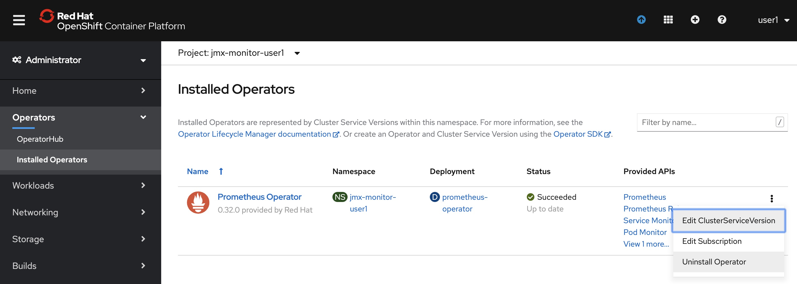
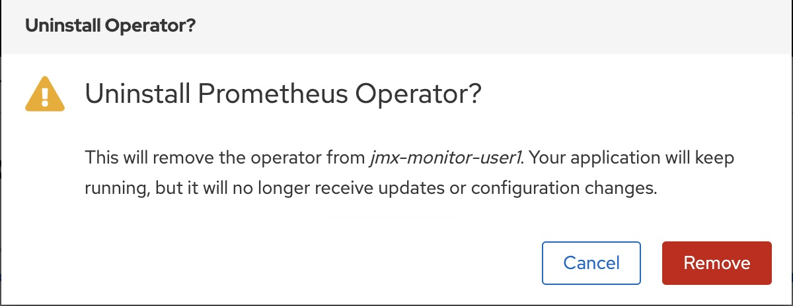

# 2. Prometheus Operatorの展開 

## 2-1. 諸注意

### 2-1-1. Prometheus Operatorについて

PrometheusOperatorは、Kubernetesサービスの簡単な監視定義、およびPrometheusインスタンスの展開と管理を提供します。    
Prometheus Operatorは次の機能を提供します。    

* 容易なPrometheusの作成/破棄：Kubernetes名前空間、特定のアプリケーション、またはチーム用のPrometheusインスタンスをOperatorを使って簡単に起動できます。
* シンプルな設定：CRDを通してPrometheusのバージョン、永続性、保存ポリシー、レプリカなどの基本設定ができます。
* ラベルを介したターゲット：Kubernetesラベルクエリに基づいて、監視ターゲット構成を自動的に生成します。そのため、Prometheus固有の言語を学ぶ必要がありません。

### 2-1-2. 事前準備

* 事前にJMX Exporterを用意しておく。
* 「OpenShift Portal」のアドレス  
例: http://console.openshiftworkshop.com  
* 「Openshift API」のアドレス <OpenShift API>  
例: https://api.cluster.openshiftworkshop.com:6443  
* OpenShiftの(system:admin)ログイン情報

## 2-2. Prometheus Operatorの展開
### 2-2-1. プロジェクト作成  
Prometheus Operator用のプロジェクトを作成する。

```
$ oc new-project jmx-monitor-<User_ID>
$ oc project
Using project "jmx-monitor-<User_ID>" on server "https://<OpenShift API>".
```

### 2-2-2. Subscriptionを作成  
ブラウザからOpenShift Portalにログインし、[Operators]>[OperatorHub]からPrometheusを検索する。   
この際、プロジェクトが「jmx-monitor-<User_ID>」であることを確認しておく。   
          


OperatorHubの中から、Prometheus Operator(Community)を選択して、[Install]を行う。        
※コミュニティ版を利用すると、警告が表示されるので、一旦[Continue]で続ける。(OCP 4.3現在)    
     


Subscriptionは、以下の設定で作成する。  
* Installation Mode  
A specific namespace on the cluster: [PR] jmx-monitor-<User_ID>  
* Update Channel  
beta  
* Approval Strategy  
Automatic   
  
|InstallMode|Action|
|:--|:--|
|OwnNamespace|Operatorは、独自のnamespace を選択するOperatorGroupのメンバーにできます。|
|SingleNamespace|Operatorは1つのnamespace を選択するOperatorGroupのメンバーにできます。|
|MultiNamespace|Operatorは複数の namespace を選択するOperatorGroupのメンバーにできます。|
|AllNamespaces|Operatorはすべての namespace を選択するOperatorGroupのメンバーできます (ターゲット namespace 設定は空の文字列 "" です)。|

実際にGUI上では以下のように設定し、[Subscribe]を選択します。
   


正しくSubscriptionが設定されると、[Status]がSucceededになりOperatorが展開されます。また、以下のように[Operators]>[Installed Operators]>[Prometheus Operator]>[Subscription]から、Subscriptionの概要が確認できます。


これで、Prometheus OperatorのSubscriptionが作成されました。なおこの時点では、CRDの登録やPrometheus Operatorの配置が行われるだけで、Prometheusのプロセス自体は構築されません。

### 2-2-3. Prometheus Operator 0.27.0のインストール

この後の演習でトラブルシューティングを行うために、意図的にバグを含んでいる古いバージョン（0.27.0）のPrometheus Operatorをインストールします。

1. 先ほどインストールした最新のOperatorをアンインストールします。[Operators]-[Installed Operators]で表示されるPrometheus Operatorから[Unistall Operator]を選択します。その後[Remove]を選択します。

    
    


2. prometheus-oprtr-0.27.0.yamlファイルをサーバ上で作成します。
    ```sh
    $ vi prometheus-oprtr-0.27.0.yaml
    ```

    ```yaml
    apiVersion: operators.coreos.com/v1alpha1
    kind: Subscription
    metadata:
    name: prometheus
    namespace: jmx-monitor-user1
    spec:
    channel: beta
    installPlanApproval: Manual
    name: prometheus
    source: community-operators
    sourceNamespace: openshift-marketplace
    startingCSV: prometheusoperator.0.27.0
    ```

3. インストールを適用します。

    ```sh
    $ oc apply -f prometheus-optr-subs.yaml
    subscription.operators.coreos.com/prometheus created
    ```

4. インストール承認をマニュアルに設定していたので、承認(`oc edit installplan`でapprovedを"true"に編集して保存)を行います。

    ```sh
    $ oc get installplan
    NAME            CSV                         APPROVAL   APPROVED
    install-w6f7r   prometheusoperator.0.27.0   Manual     false

    $ oc edit installplan
    ```

    ```yaml
    # Please edit the object below. Lines beginning with a '#' will be ignored,
    # and an empty file will abort the edit. If an error occurs while saving this file will be
    # reopened with the relevant failures.
    #
    apiVersion: operators.coreos.com/v1alpha1
    kind: InstallPlan
    metadata:
    creationTimestamp: "2020-04-28T02:11:21Z"
    generateName: install-
    generation: 1
    name: install-w6f7r
    namespace: jmx-monitor-user1
    ：
    spec:
    approval: Manual
    approved: false                           <-ここを”true”にする
    clusterServiceVersionNames:
    - prometheusoperator.0.27.0
    :

    ```


### 2-2-4. CRD/Operatorの確認    

Prometheus OperatorのSubscriptionを作成すると、CRD(Custom Resource Definition)が作成される。

```
$ oc get crd -n jmx-monitor-<User_ID> |grep monitoring.coreos.com
alertmanagers.monitoring.coreos.com                         2020-04-27T01:14:40Z
podmonitors.monitoring.coreos.com                           2020-04-27T01:14:41Z
prometheuses.monitoring.coreos.com                          2020-04-27T01:14:40Z
prometheusrules.monitoring.coreos.com                       2020-04-27T01:14:41Z
servicemonitors.monitoring.coreos.com                       2020-04-27T01:14:40Z
```


Promethus Operatorは、標準で4つ（最新バージョンでは5つ）のCRDを保持している。  
GUIからは[Operators]>[Installed Operators]>[Prometheus Operator] を確認。オペレーターカタログとして、デプロイされたPromethus OperatorのCRDが確認できる。


また、Prometheus OperatorがOLMによって配置される。

```
$ oc get po -n jmx-monitor-<User_ID>
NAME                                   READY   STATUS    RESTARTS   AGE
prometheus-operator-7cf7d5f74b-r4qmd   1/1     Running   0          16m
```

以上で、Promethus Operatorの準備が整いました。次の[CustomResourceの設定](3_CustomResource.md)作業に進む   


